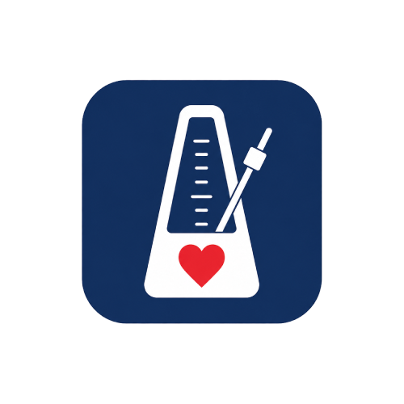

# MetronomeCPR

<p align="center">
  
</p>

A **CPR metronome** for Garmin watches. Pick a patient type — **Infant**, **Child**, or **Adult** —
and the watch beeps and/or vibrates in the correct rhythm to help you pace chest compressions
during cardiopulmonary resuscitation.

Built for the [Garmin Connect IQ](https://developer.garmin.com/connect-iq/) platform (Monkey C),
targeting as many watches as possible. Reference device: **Garmin Instinct 2X Solar**.

> **Status:** working watch-app — builds and runs on the Instinct 2X Solar. Single fixed rate per
> mode; in-app settings and wider device coverage are on the [roadmap](docs/ROADMAP.md).

---

## ⚠️ Medical disclaimer

**This app is a training and timing aid, not a medical device.** It does not diagnose,
treat, or replace professional emergency care. It is **not** certified by any medical or
regulatory body (FDA, CE/MDR, etc.).

- In a real emergency, **call your local emergency number first** (112 / 911 / 155 …) and follow the
  dispatcher's instructions.
- Get trained. Take a certified Basic Life Support (BLS) course.
- Compression **rate** is only one part of good CPR. **Depth**, full chest recoil, minimizing
  interruptions, and rescue breaths all matter and are the responsibility of the rescuer.
- The rhythm parameters here follow widely published resuscitation guidelines (see
  [`docs/CPR-REFERENCE.md`](docs/CPR-REFERENCE.md)), but guidelines are updated periodically and vary
  by region. Always defer to your current local protocol and training.

Use at your own risk. See [`LICENSE`](LICENSE).

---

## What it does

1. Select a patient type on the watch: **Infant**, **Child**, or **Adult**.
2. Start the metronome.
3. The watch emits a steady **beep** (tone) and/or **vibration** at the target compression rate.
4. Optional cues help you track compression-to-ventilation cycles (e.g. 30:2).
5. The running screen has two pages, switched with **UP / DOWN**:
   - **Beat page** (default) — beat indicator, PUSH/BREATHE cue, compression count, elapsed time.
   - **Info page** — the **time CPR started** (wall-clock) plus **GPS lat/lon** and **MGRS**
     coordinates, for handover / records / calling in a location.
6. The rhythm runs on its own timer, so **beep/vibration never pause or drift when you switch pages**.

**Controls (Instinct 2X Solar):**

| Button(s) | Action |
|-----------|--------|
| **GPS** (ENTER) | Start the metronome (single press never stops it) |
| **UP / DOWN** | Switch between the beat page and the info page |
| **GPS + ABC held together** | **Stop CPR** and return to the menu — two buttons on opposite sides, to prevent accidental stops |

Plain **BACK** is intentionally ignored while running, so the session can't be closed by mistake.

### Patient modes (defaults)

| Mode       | Target rate        | Notes                                   |
| ---------- | ------------------ | --------------------------------------- |
| **Adult**  | 110 /min (100–120) | Single-rescuer cycle 30:2               |
| **Child**  | 110 /min (100–120) | 30:2 single rescuer · 15:2 two rescuers |
| **Infant** | 110 /min (100–120) | 30:2 single rescuer · 15:2 two rescuers |

Each mode currently uses a fixed rate (in-app configuration is planned — see
[roadmap](docs/ROADMAP.md)). Rationale and sources are documented in
[`docs/CPR-REFERENCE.md`](docs/CPR-REFERENCE.md).

---

## Feedback options

Selectable in **Settings** (default: beep + vibrate):

- **Beep only** — audible tone via the Connect IQ `Attention.playTone` API.
- **Vibrate only** — silent haptic pulses via `Attention.vibrate` (useful in noisy environments).
- **Beep + vibrate** — both together.

> Not all Garmin devices have a speaker or a vibration motor. The app detects device capabilities at
> runtime and falls back gracefully (see [Supported devices](#supported-devices)).

## Settings

One setting — **Feedback** (Beep / Vibrate / Beep + Vibrate) — configurable two ways, both writing
the same value:

- **On the watch:** open the app → **Settings** (last item in the patient-type menu). Press START to
  cycle Beep → Vibrate → Beep + Vibrate.
- **From the phone:** Connect IQ / Garmin Connect app → the installed app → the **settings gear**.

Each mode's rate and compression:ventilation ratio are fixed per protocol (see the
[patient modes](#patient-modes-defaults) table and [`docs/CPR-REFERENCE.md`](docs/CPR-REFERENCE.md)).

---

## Supported devices

The goal is **all Garmin watches** that run Connect IQ. Actual behavior depends on hardware:

- **Tone / beep** requires `Toybox.Attention has :playTone` and a device with a beeper/speaker.
- **Vibration** requires `Toybox.Attention has :vibrate` and a vibration motor.

Devices lacking one modality use the other. The concrete target list lives in
[`manifest.xml`](manifest.xml) — it currently declares **`instinct2x`** only; more `<iq:product>`
entries are added to widen coverage toward the "all watches" goal.

### Reference (first) device

Development targets the **Garmin Instinct 2X Solar** (`instinct2x`) first, since it's the hardware on
hand for real-device testing. It supports **both tone and vibration**, and has a **monochrome MIP
display (176×176), no touchscreen, 5 physical buttons** — so the UI is button-driven and high-contrast.

Its display is a **semi-octagon with a small round sub-display in the top-right**. The UI is
per-device (`source/Layout.mc`): on the Instinct it keeps content clear of the sub-display and shows
the **elapsed timer inside that small circle**. Other watches get a generic centered layout until a
dedicated one is added. Device-specific notes: [`docs/DEVICE-NOTES.md`](docs/DEVICE-NOTES.md).

---

## Project structure

```
MetronomeCPR/
├── README.md                 # This file
├── LICENSE                   # MIT + not-a-medical-device notice
├── CONTRIBUTING.md           # Build & contribution guide
├── CHANGELOG.md              # Notable changes per release
├── .gitignore / .gitattributes
├── MetronomeCPR.png          # App logo / store icon (1254×1254, color)
├── MetronomeCPR-small.png    # App logo (500×500, color)
├── docs/
│   ├── CPR-REFERENCE.md      # Guideline sources & the numbers behind each mode
│   ├── DEVICE-NOTES.md       # Per-device hardware constraints (reference: Instinct 2X Solar)
│   ├── PUBLISHING.md         # Building the .iq package & Connect IQ Store submission
│   └── ROADMAP.md            # Planned milestones
├── manifest.xml              # CIQ app id (UUID), permissions, device targets
├── monkey.jungle             # Build config
├── source/                   # Monkey C (.mc) source
│   ├── MetronomeCprApp.mc     #   AppBase entry point
│   ├── ModeMenu.mc            #   Patient-type Menu2 + delegate
│   ├── CprMode.mc             #   Per-mode rhythm model (rates / ratios)
│   ├── Metronome.mc           #   Timer engine: tone + vibration, cycle tracking
│   ├── MetronomeView.mc       #   Running-screen rendering (two pages)
│   ├── MetronomeDelegate.mc   #   Button input (start, paging, two-button stop)
│   ├── Layout.mc              #   Per-device screen geometry (Instinct 2 sub-display)
│   ├── Settings.mc            #   Settings module over CIQ properties
│   └── SettingsMenu.mc        #   On-device settings menu + delegate
├── resources/
│   ├── strings/strings.xml    #   App name, menu + settings labels
│   ├── settings/              #   Phone app settings (settings.xml, properties.xml)
│   └── drawables/             #   62×62 monochrome launcher icon (device 1bpp palette)
└── store/
    └── screenshots/           # 176×176 store-listing screenshots
```

> Not in git (ignored): `bin/` (build output — `.prg`, `.iq`) and `developer_key` (signing key).

---

## Building

Requires the [Connect IQ SDK](https://developer.garmin.com/connect-iq/sdk/) and, optionally, the
**Monkey C** extension for VS Code. A generated `developer_key` (git-ignored) signs the build.

```bash
# Build & sign for the reference device (Instinct 2X Solar)
monkeyc -d instinct2x -f monkey.jungle -o bin/MetronomeCPR.prg -y developer_key -w

# Run in the Connect IQ simulator (or sideload bin/*.prg to GARMIN/APPS on the watch)
connectiq
```

Full setup (SDK path, key generation, sideloading, packaging for the store): see
[`CONTRIBUTING.md`](CONTRIBUTING.md) and [`docs/PUBLISHING.md`](docs/PUBLISHING.md).

---

## Roadmap

See [`docs/ROADMAP.md`](docs/ROADMAP.md). High level:

1. **v0.1** — docs & project scaffold ✅
2. **v0.2** — minimal metronome (timer beat, tone, start/stop) ✅ *(pending on-device verification)*
3. **v0.3** — three patient modes + vibration + capability fallbacks ✅
4. **v0.4** — in-app settings (rate, feedback type, cycle cues) *(current)*
5. **v1.0** — broad device coverage, Connect IQ Store submission

---

## Contributing

Contributions welcome — see [`CONTRIBUTING.md`](CONTRIBUTING.md). Please keep medical parameters
sourced and traceable in `docs/CPR-REFERENCE.md`.

---

## Credits

- **Development:** app built with **Claude Code** (Anthropic's Claude, Opus 4.8) — Connect IQ /
  Monkey C source, build setup, and documentation.
- **App icon / logo** (`MetronomeCPR.png`, `MetronomeCPR-small.png`): generated by **ChatGPT** (OpenAI).
- The on-watch monochrome launcher icon (`resources/drawables/launcher_icon.png`) is generated
  programmatically to fit the device's 1-bit display.

## License

[MIT](LICENSE) © 2026 Daniel Iliev.
